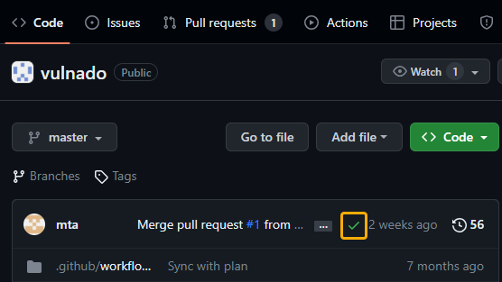

# Veracode GitHub Workflow Integration 

The Veracode GitHub Workflow Integration allows you to set up a security scanning program for all of your GitHub repositories in a single configuration file.

This repository includes the workflows required for the GitHub Workflow Integration to function correctly. In addition, it includes the configuration file, `veracode.yml`, which stores the default settings for you to scan your repositories with Veracode.

This README explains the steps required to configure your Veracode scans and view your scan results.

## Language support

The GitHub Workflow Integration supports scanning repositories written in the following languages:

| Language         | Static Support | SCA Support |
|------------------|----------------|-------------|
| Java             | X              | X           |
| JavaScript       | X              | X           |
| TypeScript       | X              | X           |
| Python           | X              | X           |
| PL/SQL           | X              |             |
| Transact-SQL     | X              |             |
| C#               | X              | X           |
| PHP              | X              | X           |
| Perl             | X              |             |
| Go               | X              | X           |
| Visual Basic 6.0 | X              |             |
| Apex             | X              |             |

For Static Analysis, the GitHub Workflow Integration automatically compiles the repository by default. However, for some applications, you may need to provide specific compilation instructions in the original repository. See the [packaging requirements](https://docs.veracode.com/r/compilation_packaging) for each language.

For SCA, see the [agent-based scan support matrix](https://docs.veracode.com/r/c_sc_agent_languages) for additional support details.

## GitHub support

The GitHub Workflow Integration is supported on GitHub Enterprise. It is not supported on GitHub Enterprise Server.

## Fork or import the integration repository for scanning select repositories

You must fork or import the Veracode repository for the GitHub Workflow Integration into your organization's root folder to enable Veracode scans of specific repositories and customize the behavior of the integration. If you want to grant Veracode access to all repositories, skip this task.

### Fork the repository

1. Fork this repository. See the [GitHub Docs](https://docs.github.com/en/get-started/quickstart/fork-a-repo#forking-a-repository) for more details on forking repositories.
2. Clone the new repository to your organization account, and name the cloned repository `veracode`. See the [GitHub Docs](https://docs.github.com/en/get-started/quickstart/fork-a-repo#cloning-your-forked-repository) for more details on cloning forked repositories.
3. If you want to limit the scope to a subset of your repositories, you must have added the `veracode` repository to the list of selected repositories. If you don't include the `veracode` repository, you cannot trigger scans.

### Import the repository

Importing the repository, instead of forking, lets you set your `veracode` repository as private.

1. [Import a new repository](https://github.com/new/import).
2. Set the `github-actions-integration` repository as the clone URL: `https://github.com/Veracode-Workflow-App-preprod/github-actions-integration`
3. Select **Private**.
4. Select **Begin import**.

## Enable GitHub Actions

Ensure that this repository and the repositories you want to scan have [GitHub Actions enabled](https://docs.github.com/en/repositories/managing-your-repositorys-settings-and-features/enabling-features-for-your-repository/managing-github-actions-settings-for-a-repository).

## Setting up GitHub secrets for scanning

You must add the appropriate GitHub secrets to this repository to enable the GitHub actions that run when a specified GitHub event is triggered.

### Configure Veracode API ID and Key for Static Analysis

1. [Generate your Veracode API ID and Key](https://docs.veracode.com/r/t_create_api_creds) from the [Veracode Platform](https://analysiscenter.veracode.com/auth/index.jsp#APICredentialsGenerator).
2. Configure a [Github secret in your repository](https://docs.github.com/en/actions/security-guides/using-secrets-in-github-actions#creating-secrets-for-a-repository) called `VERACODE_API_ID' for your Veracode API ID and another called 'VERACODE_API_KEY' for your API key.

### Configure SCA agent token

Veracode uses the SCA agent within your workflows to scan your code.  

1. Identify the agent token value for the SCA workspace in which you want your scan results to appear. If you do not know the token, you can [regenerate it](https://docs.veracode.com/r/Regenerate_Veracode_SCA_Agent_Tokens). 
2. Configure a [Github secret in your repository](https://docs.github.com/en/actions/security-guides/using-secrets-in-github-actions#creating-secrets-for-a-repository) called `VERACODE_AGENT_TOKEN' for your token.


## How scanning works

In your `veracode.yml` file, you can customize the behavior of the GitHub Workflow Integration. You can apply several configurations, including:
- The types of scans to run
- Which branches to target
- Which Veracode security policy to apply
- Whether a failure breaks the build
- Whether the scan is triggered by a push or a pull
- The compilation instructions

See the [full list of available configurations](#veracodeyml-configurations).

By default, your `veracode.yml` file is configured with the following scan triggers:
- Static pipeline scan on any push activity on any branch
- SCA agent-based scan on any push activity on any branch
- Veracode Container Security scan on any push activity on any branch

If you [set `analysis_on_platform` to `true`](#veracodeyml-configurations), these additional scans are triggered by default: 
- Sandbox scan, which sends results to the Veracode Platform, when a pull request is open to [your `analysis_branch`](#veracodeyml-configurations)
- Policy scan, which sends results to the Veracode Platform, after code is merged into your `analysis_branch`

You can configure all of these to fit your own organization's process by editing the `veracode.yml` file.

### Specify repositories to scan

By default, the GitHub Workflow Integration scans all repositories except for the `veracode` repository.

#### Exclude specific repositories

1. Open `repo_list.yml` in the `veracode` repository.
2. Under `exclude_repos:` enter the list of repositories you want to exclude. Each repository name must be surrounded by single quotes. For example: `'java_Repo'`

#### Include only specific repositories

1. Open `repo_list.yml` in the `veracode` repository.
2. Under `include_repos:` enter the list of repositories you want to include. Each repository name must be surrounded by single quotes. For example: `'java_Repo'`
3. If the list includes `'*'`, delete it. If it is present, Veracode will scan all repositories that are not listed under `exclude_repos:`.

### `veracode.yml` configurations

In your `veracode.yml` file, you can configure the following values to customize the integration:

| Value                              | Description                                                                                                                                                                                                                                                   | Default value                                                                                         |
|------------------------------------|---------------------------------------------------------------------------------------------------------------------------------------------------------------------------------------------------------------------------------------------------------------|-------------------------------------------------------------------------------------------------------|
| `push`:`trigger`                   | If `true`, a pipeline scan is triggered when you commit changes to a branch.                                                                                                                                                                                  | `true`                                                                                                |
| `push`:`branches_to_run`           | The branches that trigger pipeline scans when you commit changes. If `'*'`, all branches can trigger scans.                                                                                                                                                   | `'*'`                                                                                                 |
| `push`:`branches_to_exclude`       | The branches that do not trigger scans. Only applies if `branches_to_run` is set to `'*'`.                                                                                                                                                                    |                                                                                                       |
| `pull_request`:`trigger`           | If `true`, a scan is triggered when you perform a pull request action.                                                                                                                                                                                        | `true`                                                                                                |
| `pull_request`:`action`            | Pull request actions that trigger scans. Valid values are: `opened`, `reopened`, `edited`, `synchronize`, `closed`.                                                                                                                                           | `opened` and `synchronize`                                                                            |
| `pull_request`:`target_branch`     | The target branch that triggers scans when you perform pull request actions.                                                                                                                                                                                  | `default_branch`                                                                                      |
| `analysis_branch`                  | The branch submitted to the Veracode Platform for analysis. If you do not enter a valid branch name, Veracode uses the default branch.                                                                                                                        | `default_branch`                                                                                      |
| `analysis_on_platform`             | If `false`, no scans are submitted to the Veracode Platform. If `true`, scans from the `analysis_branch` are submitted to the Platform, creating an [application profile](https://docs.veracode.com/r/request_profile) that has the repository's name. | `false`                                                                                               |
| `break_build_policy_findings`      | If `true`, the build breaks when the policy name is invalid.                                                                                                                                                                                                  | `true`                                                                                                |
| `error_message`                    | The error message that appears when the build fails.                                                                                                                                                                                                          | `Veracode SAST scan faced a problem. Please contact your Veracode administrator for more information.` |
| `policy`                           | The [application security policy](https://docs.veracode.com/r/c_appsec_policies) applied to your scan findings, if a policy is not already assigned to your application profile.                                                                                    | `'Veracode Recommended Medium + SCA'`                                                                 |
| `create_code_scanning_alert`       | If `true`, GitHub generates alerts for your Static Analysis findings in the [Security tab](https://docs.github.com/en/code-security/code-scanning/managing-code-scanning-alerts/managing-code-scanning-alerts-for-your-repository).                           | `false`                                                                                               |
| `create_issue`                     | If `true`, GitHub generates [issues](https://github.com/features/issues) for scan findings.                                                                                                                                                                   | `false`                                                                                               |
| `profile`                          | The [application profile](https://docs.veracode.com/r/request_profile) associated with the GitHub project.                                                                                                                                             | The name of the GitHub repository                                                                     |
| `issues`:`trigger`                 | If `true`, a scan is triggered when you create an issue containing the `commands` value or add a comment containing the `commands` value to an issue.                                                                                                         | `false`                                                                                               |
| `issues`:`commands`                | The text that triggers an [on-demand scan](#trigger-on-demand-scanning-with-github-issues) when you add it to a GitHub issue.                                                                                                                                 | `"ENTER_COMMAND_TO_EXECUTE_SCAN"`                                                                     |
| `use_custom_workflow`              | The workflow the Veracode Workflow App uses to build your project before scanning. By default, it uses the workflows in the `veracode` repository’s `.github/workflows folder`. You might want to customize it in a developer's repository.                   | The workflows in the `veracode` repository’s `.github/workflows folder`                               |
| `filter_mitigated_flaws`           | If `true`, mitigated flaws are excluded from repository checks, the Issues tab, and the code scanning alerts.                                                                                                                                                 | `true`                                                                                                |

### Configure integration for individual repositories

Adding a `veracode.yml` file to individual repositories lets you overwrite specific scan settings defined in your organization's central `veracode.yml` file.

To overwrite the settings:

1. Add a `veracode.yml` file to the root of your developer's repository.
2. Add the updated configuration to the file. All `veracode.yml` files must include the heading and the value that you want to overwrite. For example, this `veracode.yml` file overwrites the policy applied to Static Analysis scans and sets a custom workflow for the repository:

    ```yaml
   veracode_static_scan:
    policy: 'Veracode Recommended Very High'
    use_custom_workflow: my_custom_build
   ```
Note: If you’d like to use your source repository’s build workflows to prepare an artifact for scanning - please see our [documentation](https://docs.veracode.com/r/GitHub_Workflow_Integration_for_Repo_Scanning).

### Trigger on-demand scanning with GitHub issues

You can trigger scans on demand using GitHub issues.

**Before you begin**

- Have permissions to [create issues in GitHub](https://docs.github.com/en/issues/tracking-your-work-with-issues/creating-an-issue).
- In your `veracode.yml` file, under `issues`:
  - Set `trigger` to `true`.
  - Set `commands` to the value that you will use as the description for your issues. If you want to trigger Static Analysis, SCA, and Container Security scans separately, they must have different `commands` values.

**To complete this task:**

1. In your GitHub repository, select the **Issues** tab.
2. Enter a title.
3. In the **Add a description** field, enter the [`commands` value](#veracodeyml-configurations) from the `veracode.yml` file. For example, `veracode-static-scan` or `veracode-sca-scan`. By default, this triggers a policy scan of the [analysis branch](#veracodeyml-configurations), which is usually the main branch. 
    To include multiple commands, enter a comma-separated list. To specify a branch to scan, add the branch in parentheses. For example, `veracode-static-scan[branch:dev-patch-101]`.  
4. To trigger additional scans for the same issue, enter the `commands` value in a comment on the issue.

On-demand scan findings, like the push-triggered scans findings, are available in the [check](https://docs.github.com/en/pull-requests/collaborating-with-pull-requests/collaborating-on-repositories-with-code-quality-features/about-status-checks#checks) for the repository. 

## View results in GitHub

You can view Veracode scan results in GitLab in status checks of the repository, as code scanning alerts, and as issues.

### Status checks

After scans of a repository are complete, the Veracode security findings are available in the [check](https://docs.github.com/en/pull-requests/collaborating-with-pull-requests/collaborating-on-repositories-with-code-quality-features/about-status-checks#checks) for the repository.

To view the findings:

1. Open a GitHub repository in which a scan has been completed.
2. Select the branch you want to view.
3. Select the status icon of the check. The icon can be a green checkmark, a red X, or an orange circle to indicate that the security checks were successful, unsuccessful, or in progress, respectively.
   
   
4. Select **Details**.

For scans triggered by a pull request, you can also view the findings on the request.

1. Open a GitHub repository in which a scan has been completed.
2. Select the **Pull Requests** tab.
3. Select the pull request.
4. Select the **Checks** tab or the **Files changed** tab.
   The **Files changed** tab displays the findings details inline, so you can see exactly where in the code the flaw was identified.

### Code scanning alerts

You can view your Static Analysis findings as [code scanning alerts in GitHub](https://docs.github.com/en/code-security/code-scanning/managing-code-scanning-alerts/about-code-scanning-alerts).

**Before you begin**

- Have code scanning alerts enabled for your repository.
- In your `veracode.yml` file, have `create_code_scanning_alert` set to `true`.

**To complete this task:**

1. Open a GitHub repository in which a scan has been completed.
2. Select the **Security** tab.
3. Select **Code scanning**.
4. Select the finding you want to review.

### GitHub Issues

If you have used [on-demand scanning with GitHub issues](#trigger-on-demand-scanning-with-github-issues), you can view your issues [in the dashboard for your project](https://docs.github.com/en/issues/tracking-your-work-with-issues/viewing-all-of-your-issues-and-pull-requests).

## Reviewing results in the Veracode Platform

If you [set `analysis_on_platform` to `true`](#veracodeyml-configurations), you can view scan results in the Veracode Platform.

Static Analysis scans return a list of annotations describing each static flaw and a link to the Veracode Platform where you can view a full report of your results. If an [application profile](https://docs.veracode.com/r/request_profile) for a scanned repository does not already exist in the Veracode Platform, Veracode automatically creates one using the name of the repository as the name of the profile.

If you mitigate findings from Static pipeline scans, by default, Veracode synchronizes your findings so that the mitigated findings do not appear in subsequent pipeline scans.

For more information on reviewing Static Analysis findings, see [Reviewing scan results](https://docs.veracode.com/r/review_results).

SCA scans return a summary report of your open-source security findings as well as a detailed list of libraries, vulnerabilities, and licenses. For more information about SCA findings, see [Viewing agent-based scan results](https://docs.veracode.com/r/Viewing_Agent_Based_Scan_Results).
